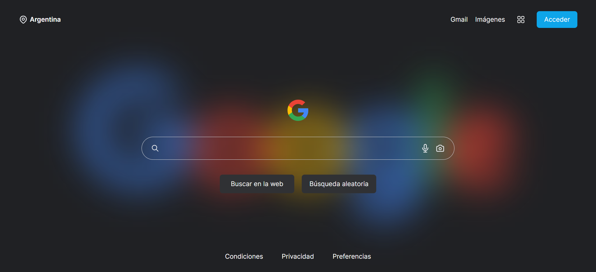

# Web Browser - Next js

This is a personal project using the Google search API. I found a [redesign of the home page on Dribbble](https://dribbble.com/shots/17222719-Google-Browser-Template-Redesign/attachments/12326305?mode=media), so I decided to take it to the web and add some Google functionalities. Hope you like!

## Table of contents

- [Overview](#overview)
  - [Screenshot](#screenshot)
  - [Links](#links)
- [My process](#my-process)
  - [Built with](#built-with)

## Overview

### Screenshot

### Links

- Live Site URL: [https://web-browser-jbdev.vercel.app/]

## My process

### Built with

- Flexbox
- CSS Grid
- Mobile-first workflow
- JavaScript - Next js
- Tailwind CSS - For styles
